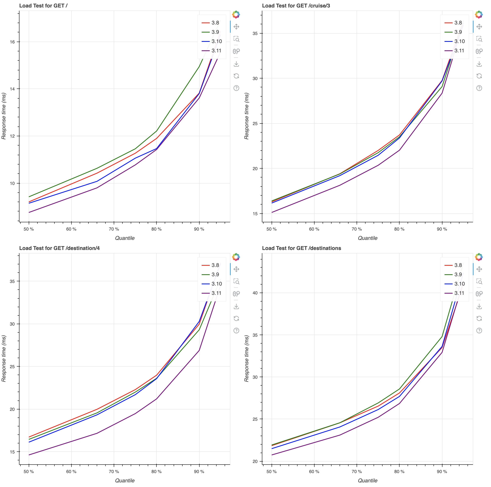

# pyUpgradeSim

A set of scripts to launch Docker images with a web application with different Python versions and a load test to benchmark them.

## Usage

Run `make images` to build the container images

Run `make benchmarks` to run the benchmarks.

Use `analysis.ipynb` to inspect and analyse the data from the resulting CSV files.

## Results

The load tests show an improved response time across the application for Python 3.11 compared with supported previous releases (3.8-3.10):

